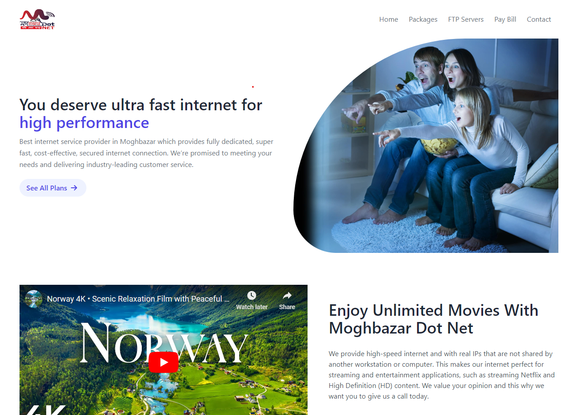
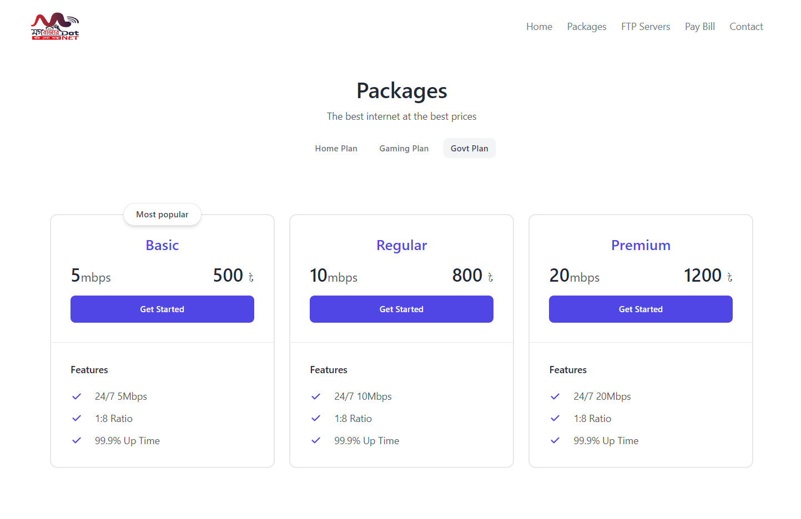
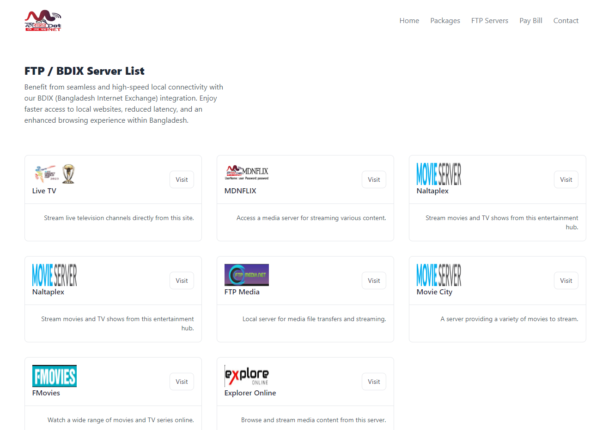

<!-- PROJECT LOGO -->
 

  

  <h3 align="center">Moghbazar Dot Net</h3>

  

    An ISP website for moghbazar dot net company
  

  
    Live Link : 
    <a href="#">Click Here</a>
  

<!-- ABOUT THE PROJECT -->

## About The Project

Welcome to the official website of Moghbazar dot net, your reliable local Internet Service Provider. Our website is designed to provide a seamless and user-friendly experience, ensuring that you can easily access all the information and services you need.

Key Features:

- Package Pricing : Explore our diverse range of internet packages tailored to meet your specific needs. From basic plans for casual browsing to high-speed packages for heavy usage, find the perfect plan that suits your lifestyle and budget.

- FTP Server Access : Gain direct access to our FTP server site, allowing you to manage your files with ease and efficiency. This feature is designed to provide our customers with convenient and secure file transfer capabilities.

- Payment Information : Stay informed about your billing details and payment options. Our comprehensive payment section offers clear and concise information to help you manage your account effortlessly.

- Contact Us : Have questions or need support? Reach out to us through our contact page. We are here to assist you with any inquiries or issues you may have, ensuring you receive the best possible customer service.

(<a href="#readme-top">back to top</a>)

<!-- BUILT WITH -->

### Built With

These packages collectively provide a robust and efficient development environment, enabling the creation of a performant and maintainable web application for Moghbazar dot net ISP :

- Vite: Chosen for its fast build times and excellent development experience with features like hot module replacement.
- React and React DOM: The foundational libraries for building a modern, interactive user interface.
- React Router DOM: Facilitates the creation of a single-page application (SPA) with navigation between different views.
- Tailwind CSS: Provides a utility-first approach to styling, allowing for rapid and consistent design implementation.
- Radix UI Tabs: Adds accessible and customizable tab components, enhancing the user interface.
- ESLint and associated plugins: Ensures code quality and consistency by catching errors and enforcing coding standards.

(<a href="#readme-top">back to top</a>)

<!-- INSPRIATION -->

## Inspiration

I have developed this unofficial website as a practice project. Moghbazar dot net has an official website, which you can visit via the link below.

Click here to visit [Official Website](https://moghbazar.net/)

(<a href="#readme-top">back to top</a>)

<!-- CONTACT -->

## Contact

MH Murshed - [Facebook](https://facebook.com/mh.murshed.75) - murshed1806@gmail.com

Portfolio Link: [https://xparif.github.io](https://xparif.github.io/)
